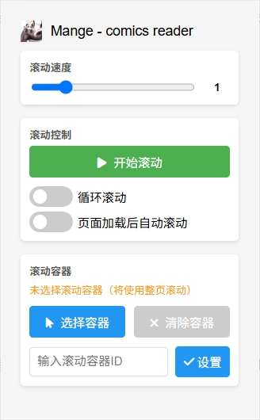

# 漫画阅读助手 - 浏览器扩展

这是一个专为漫画阅读设计的Chrome浏览器扩展，提供以下功能：

## 主要功能

1. **自动滚动** - 解放双手，舒适阅读漫画
   - 可调节滚动速度
   - 一键开始/停止
   - 智能滚动算法
   - 页面悬浮按钮控制（可拖动位置）

<!-- 2. **暂停放大** - 停止滚动时自动放大当前查看的内容
   - 自动识别漫画面板
   - 点击任意位置退出放大模式
   - 高清放大不失真

3. **沉浸式全屏** - 提供沉浸式的漫画阅读体验
   - 隐藏浏览器界面和其他干扰元素
   - 鼠标移动时显示控制条
   - 美观的背景设计 -->

## 使用方法

1. 将扩展安装到Chrome浏览器中
2. 进入漫画网站
3. 点击工具栏上的扩展图标打开控制面板
4. 调整滚动速度和其他设置
5. 点击"开始自动滚动"即可享受舒适的阅读体验

## 扩展安装

1. 下载本仓库的所有文件
2. 打开Chrome浏览器，进入 chrome://extensions/
3. 开启"开发者模式"（右上角）
4. 点击"加载已解压的扩展程序"
5. 选择本项目的文件夹

## 注意事项

- 目前版本完全在客户端执行，不会收集任何用户数据
- 在不同漫画网站上的效果可能有所差异

## 许可证

MIT 许可证 - 详见 LICENSE 文件
